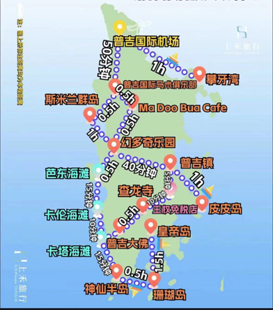

---
date:
  created: 2024-06-26
slug: phuket-island
categories:
  - Travel
status: new
comments: true
---

# 冲击普吉岛

<!-- more -->

## 交通

### 机场大巴指南

- **100泰铢**

- 可去**三大海滩**（**芭东**、**卡伦**、**卡塔**）以及**普吉镇**

???+ info "机场大巴路线"

    1. 从行李提取的左边看到（ 图1）的门 直接走进去走到出口（ 图2）
    2. 看到写着7-8的牌子 左转（ 图3） 的方向就是8号门
    3. 一直走到（ 图4） 过这个门门口牌子上有bus的图片（ 图5）就是8号门
    4. 直接走出去 走过（ 图6） 这一条走廊就到了（ 图7） 这个门进去就是普吉岛机场国内航站楼了
    5. 然后继续直走（ 图8） 这条路直行到（ 图9） 这个门

### 机场出口柜台minibus

- 到**卡伦和卡塔海滩200泰铢**，到**芭东海滩180泰铢**
- **下飞机-黄色小亭买票-人满发车-送到旅行社登记酒店地址-送去酒店**。全程**一个多小时**，比较费时间路上会推销

### bolt打车

去**三大海滩普吉镇**，大概**500-600泰铢**，但是要走出机场去坐车，软件的车不让进机场

### 飞猪携程接机

- **100+** 方便

## 酒店

- [KARON SEA SANDS RESORT（点击跳转酒店官网）](https://karonseasand.com/)
- 地址：208/2, Karon Beach, Karon, Amphoe Muang Phuket 83100 Thailand
- 电话：+66 (0)76 286 464
- 邮件：[info@karonseasand.com](mailto:info@karonseasand.com)
- 24小时营业

!!! note "注意"

    - 入住时间： 15：00
    - 退房时间： 11：00
    - 延迟退房时间： 18：00
    - 延时退房费用：50%
    - 延迟退房（11：00后至18：00之前）可能会收取额外费用。

## 公共交通

- 普吉岛有**双条车**往来巴东、卡塔、卡伦、普吉镇。
- **40泰铢**一位 看到了**招手即停**，平均一班车**30分钟**一趟

## 行程备选

### 普吉岛地图及交通

### 出海

#### 皇帝岛

找岛主定了贝拉号一日游，大约9点半左右接人。行程是**珊瑚岛+皇帝岛**一日游，一艘比较小众的船，船体很大，当天就二三十人，坐的相当舒服，这艘帆船的导游及船员都训练有素，非常耐心和专业，也有很多带孩子的家庭，船员还能帮忙带孩子，十分贴心，行程特别**适合懒人**，回程的时候在网兜上躺着吹海风晒太阳十分惬意。行程也**没有什么别的消费**，但是因为船员们服务很好很辛苦，我个人给了一点小费（当然不给也没事）。

#### 皮皮岛

选择了**天鹅号出海**，行程线路是**玛雅湾-天堂湾**（可加300泰铢/人乘坐特色长尾船）**-维京洞穴-猴子湾-大小皮皮岛-蛋岛**，皮皮岛的景色和皇帝岛截然不同，如果皇帝岛是蓝宝石那皮皮岛就是绿翡翠，各有各的美，喀斯特地貌赋予皮皮岛独特的海水颜色，不同的山峦屹立在海面上，赏心悦目。

### 环岛一日游

[环岛包车（人多超级划算）](https://mp.weixin.qq.com/s/19m6I1Rs5FHm_DDJJnwv6A)

报价参考

行程参考

### 丛林飞跃

[丛林飞跃（最刺激的陆地项目）](https://mp.weixin.qq.com/s/cklFdKczIDO5CJM4DJJuSQ)

价格1：300-600左右

价格2：**出发普吉岛小程序**（18站不含餐400；32站不含餐500；含餐+100）

游玩时间：**8：00，10：00，13：00；15：00四个场次任选，**其中10点场次选择人最多，所以**旺季必须提前2天以上**预订，其余场次请提前一天12点预订。

游玩地点：**普吉镇地区**

!!! note "注意事项"

    1、丛林有**接送范围**，看清自己酒店是否免费接送
    
    2、衣服着装：以轻便为主，建议**长袖长裤**，**不能穿拖鞋**，游玩之前喷**防蚊水**
    
    3、禁止超过60岁以上，小孩4岁以下，孕妇，近期做过手术，体重超过120Kg的游玩

### leam sai cup cafe悬崖咖啡厅

### 普吉镇+周末夜市

平日里**芭东有马林夜市+班赞夜市**，**卡塔有卡塔夜市**，**普吉镇有青蛙夜市**，**双休日有最大的naka夜市和周末老街夜市**。下午乘坐**双条车**前往**普吉老街**，**40猪一位**，**时间比较久**但是省钱。如果到的早可以去**普吉镇尚泰**逛一逛，这里是**普吉岛最大的商场**，比较繁华。

**老街夜市**差不多**6点**开始陆续摆摊，人也多了起来，现在的老街有两条大路都是夜市，热闹非凡，有许多的小吃和各种手工艺品，也可以让画家给自己画一幅画像，一路的小吃摊眼花缭乱根本吃不完，需要注意的是这里基本全都是用**现金**支付，来之前可以去**711兑换一点零钱**比较方便。**晚上回酒店需要另外打车**， **bolt到卡塔差不多300-400泰铢**。

### 拉威+班赞

普吉岛比较有名的**海鲜市场**有**拉威海鲜市场**和**班赞海鲜市场**，都可以在附近找到海鲜加工店就地大快朵颐。

**拉威**海鲜市场开价低一点，不允许砍太多，一般也就**七八折**。但是每个**摊位浮动蛮大**，只能多跑几个摊位，**多对比**，不要急着买。拉威海鲜那里 **mook manee**餐厅做的非常好吃 这家餐厅是米其林上榜的（这个加工餐厅比较出名，有百分之十服务费，其实它隔壁几家加工也不错）

!!! note "**班赞**砍价超级攻略"

    - **不用称重 全部选好了让他开价 目测估价 一刀砍到位 果断坚决自信，显得自己很懂行情。因为秤也不准，称来称去反而容易被他们忽悠。**~~这个多少钱一斤啊，那个多少钱一斤啊……~~
    
    - **大概是砍三折左右**，看对方开价是否虚高，一般**小青龙五六百泰铢**（经典两人套餐比如一只青龙，三四只中等皮皮虾，两只梭子蟹，一点贝类，两个人大概是**1500**泰铢左右，加工费**400泰铢**）砍价的同时，小心掉包，一般是价格谈不拢，你要走，回头的时候掉包换小的，喊你回来。砍完之后去二楼加工，加工费也可以**砍七折**，比如常见的你的厨房，山东厨房，广东厨房。

可以去**芭东江西冷的bigc**买点**特产**带回家，小程序也可以直接下单送到国内傍晚可以去**神仙半岛**看个日落

### 按摩店

#### 芭东

- Claretta2 massage
- Ayatana massage
- Hatha massage
- Fly High massage

#### 卡塔

- Sweet lemon massage

- Grandmon relax massage

- Pearl massage

- Massage Empire

#### 普吉镇

- Sea massage

- Kim‘s massage

- phumontra

    ---

    最好**提前预约**，闲鱼有代订

- Leela Massage

## 温馨提示

{==

- 如果要**出海**可以提前在淘宝上购买**沙滩袜**（上船不能穿鞋，也可以防止礁石贝壳划伤脚）、**手机防水袋**（买来后可以放一张纸巾泡在水里测试一下密封程度）
- 本地租摩托一定**提前谈好价格**拍摄**车身完整视频**避免还车时被讹诈，经理选择**押金不要压护照**
- 711门口经常有老外说没见过人民币想看看，还给你的时候你会发现钱被偷走了几张
- 第一次来泰国的朋友**吃生腌**一定要**注意小心拉肚子**，经常有腹泻耽误第二天行程的情况
- 海滩边的**摩托艇**和**拖曳伞**慎重选择，几乎没有什么安全保障出意外自身容易受伤还可能涉及高额赔偿

==}

## 软件

- BOLT：普吉岛打车的第一梯队，远距离的神，起步费比较贵，一般150-200泰铢，但是十公里也是差不多200多猪，虽然有的时候车牌会货不对板但是绝大部分司机都不错，付款主要以**现金**为主
  - 费用大致如下：
      1. 机场到芭东 卡伦 卡塔 普吉镇约400-600猪
      2. 芭东 卡伦 卡塔至普吉镇约200-300猪
      3. 查龙码头至机场500-600猪
- GRAB：在**曼谷**好使，在**普吉岛好贵**，优点是**可以支付宝**，近距离或者单人出行可以在上面打摩的。GRAB也可以作为**外卖软件**，商家多，速度也还可以，可以直接在APP打中文，双边都可以翻译，以**现金**支付为主。
- FOODPANDA：外卖软件，可以微信支付宝支付，但是商家没有GRAB多。
- GOOGLE翻译：可以拍照翻译，速度还可以，但是泰语翻译不管哪个软件翻译都奇奇怪怪。
- GOOGLE MAPS:普吉岛最好用的地图，可以找饭店找按摩店，并且评分都比较靠谱，基本不会踩雷，但是要用泰国手机卡才能到泰国正常使用，国内卡开漫游不好使，有WIFI可以（国内需要梯子才能打开）。
- 大众点评：懂得都懂，中国人的老朋友了，射击，老虎园都可以在上面团购。
- 十六番：可以作为美食或景点地图使用，可以规划行程。
- 百度地图：导航还可以，GOOGLEMAPS用不了的情况下可以选择它。  