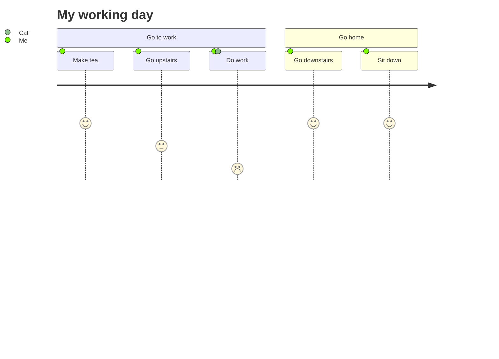

# This is for test: overview

> reference: [Material for Mkdocs reference](https://squidfunk.github.io/mkdocs-material/reference/)

## Just for Test

## to-do list

- [x] afds
- [x] afe
  - [ ] fs

## Term: Definition

> In the context of a definition list, a colon is used to separate a term from its definition.

`Lorem ipsum dolor sit amet`

:   Sed sagittis eleifend rutrum. Donec vitae suscipit est. Nullam tempus
    tellus non sem sollicitudin, quis rutrum leo facilisis.

## emoji

:smile:

## icon

:fontawesome-regular-face-laugh-wink:

<!-- more -->

## Code

### Multiple line code

``` cpp title="Hello.cpp"
#include <iostream>

int main()
{
    std::cout << "Hello, world!" << std::endl;
    >=

    return 0;
}
```

``` python title="Hello.py"
print("Hello, world!")
```

### Inline code

No language`print("Hello, world!")`
Specify language`#!python print("Hello, world!")`

### Code annotation

``` yaml
theme:
  features:
    - content.code.annotate # (1)
```

1. :man_raising_hand: I'm a code annotation! I can contain `code`, __formatted
    text__, images, ... basically anything that can be written in Markdown.

## Keyboard keys

++ctrl+alt+del++

## Highlighting changes

Text with suggested changes

Text can be {--deleted--} and replacement text {++added++}. This can also be
combined into {~~one~>a single~~} operation. {==Highlighting==} is also
possible {>>and comments can be added inline<<}.

{==

Formatting can also be applied to blocks by putting the opening and closing
tags on separate lines and adding new lines between the tags and the content.

==}

## Highlighting text

- ==This was marked==
- ^^This was inserted^^
- ~~This was deleted~~

## Sub- and superscripts

- H~2~O
- A^T^A

## Card grid

<div class="grid cards" markdown>

- :fontawesome-brands-html5: __HTML__ for content and structure
- :fontawesome-brands-js: __JavaScript__ for interactivity
- :fontawesome-brands-css3: __CSS__ for text running out of boxes
- :fontawesome-brands-internet-explorer: __Internet Explorer__ ... huh?

</div>

## Admonitions

!!! note "Note title"

    This is a note

??? abstract inline "Abstract title"

      This is an abstract

??? info inline "Info title"

    This is an info

??? tip end "Tip title"

    This is a tip

??? success inline "Success title"

    This is a success

??? question inline "Question title"

    This is a question

??? warning end "Warning title"

    This is a warning

??? failure inline "Failure title"

    This is a failure

??? danger inline "Danger title"

    This is a danger

??? bug end "Bug title"

    This is a bug

??? example inline "Example title"

    This is an example

??? quote inline "Quote title"

    This is a quote

??? note end "folded note"

    This is a note without title and could be folded, default is folded

???+ warning "folded warning"

    This is a warning without title and could be folded, default is unfolded

## footnotes

Lorem ipsum[^1] dolor sit amet, consectetur adipiscing elit.[^2]

## mermaid



## table

|  Method  |             Description              |
| :------: | :----------------------------------: |
|  `GET`   | :material-check:     Fetch resource  |
|  `PUT`   | :material-check-all: Update resource |
| `DELETE` | :material-close:     Delete resource |

## Content tabs

=== "C"

    ``` c
    #include <stdio.h>

    int main(void) {
      printf("Hello world!\n");
      return 0;
    }
    ```

=== "C++"

    ``` c++
    #include <iostream>

    int main(void) {
      std::cout << "Hello world!" << std::endl;
      return 0;
    }
    ```

[^1]: Lorem ipsum dolor sit amet, consectetur adipiscing elit.
[^2]:
    Lorem ipsum dolor sit amet, consectetur adipiscing elit. Nulla et euismod
    nulla. Curabitur feugiat, tortor non consequat finibus, justo purus auctor
    massa, nec semper lorem quam in massa.
